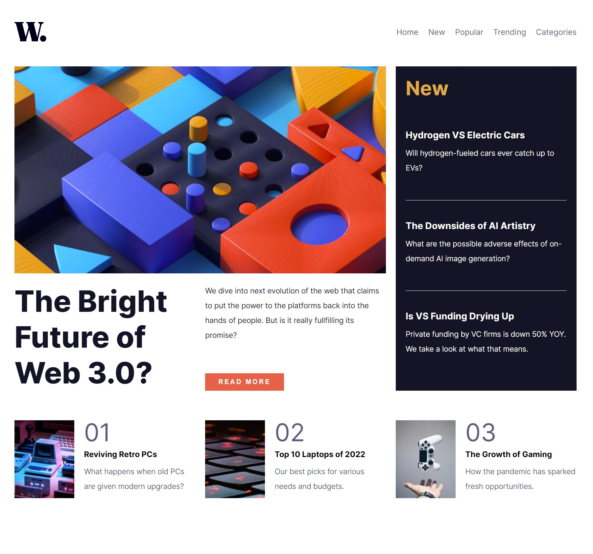

# Frontend Mentor - News homepage solution

This is a solution to the [News homepage challenge on Frontend Mentor](https://www.frontendmentor.io/challenges/news-homepage-H6SWTa1MFl).

## Overview

### The challenge

Users should be able to:

- View the optimal layout for the interface depending on their device's screen size
- See hover and focus states for all interactive elements on the page
- **Bonus**: Toggle the mobile menu (requires some JavaScript)

### Screenshot

### Links

- Live Site URL: [Add live site URL here]([https://your-live-site-url.com](https://6362491617094c74828aa87d--deluxe-puffpuff-31808d.netlify.app/)

### Built with

- Semantic HTML5 markup
- SASS
- Flexbox
- CSS Grid
- React

### What I learned

Learned to use SASS variables in React, improved CSS Grid knowledge, cleaner code.
